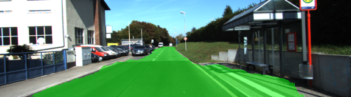
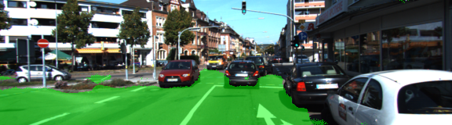
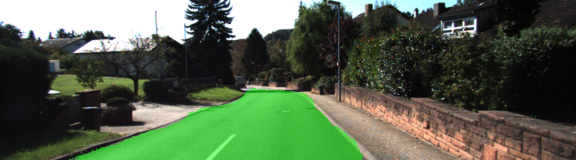

# Semantic Segmentation Project
### Introduction
In this project, we will label the pixels of a road in images using a Fully Convolutional Network (FCN).

### Setup
##### Frameworks and Packages
Make sure you have the following is installed:
 - [Python 3](https://www.python.org/)
 - [TensorFlow](https://www.tensorflow.org/)
 - [NumPy](http://www.numpy.org/)
 - [SciPy](https://www.scipy.org/)
##### Dataset
Download the [Kitti Road dataset](http://www.cvlibs.net/datasets/kitti/eval_road.php) from [here](http://www.cvlibs.net/download.php?file=data_road.zip).  Extract the dataset in the `data` folder.  This will create the folder `data_road` with all the training images.

### Run the project
Run the following command to run it, the network will be trained and be saved in `runs` folder :
```
python main.py
```

### Description
#####Architecture
The architecture used to build the FCN is known as [FCN-8](https://people.eecs.berkeley.edu/~jonlong/long_shelhamer_fcn.pdf). FCNs are known to work really well on segmentation tasks.

In our case we use the VGG-16 model pretrained on ImageNet as encoder. Then we replace the fully-connected layers by a 1-by-1 convolution with 2 kernels corresponding to our classes ( road - not road ). Then the decoder is done by upsampling till original image size. In our case we used 3 layers. We added as well skip connections from vgg layers 3,4,7 by using a 1-by-1 convolution and combining the results by element wise addition with previous layer in the decoder part.

#####Training

To train the network i used the cross entropy loss on a  flatten output over different classes.
 I used the Adam optimizer with a fairly low learning rate at 0.0001.
 Also i used a different initializer for the layer's kernel to reduce the standard deviation to 0.01. The default one was giving really slow learning.
 I added some augmentation techniques in the `helper.py`. I Added random luminosity, random rotation, random translation and random flip.
 
 I used only 20 epochs as the loss was not improving further after. It takes around 15mins to train the network using a GTX 1060.
 
#####Hyper parameters

* Learning rate = 0.0001
* Batch size = 8
* Epochs = 20
* Dropout = 0.5
* Initializer standard deviation = 0.01
  
###Results
 
Here some pictures where we can see that the segmentation is really good. I was impressed by the result for a small addition to VGG16 and training on a relatively small dataset.

 
 
 


